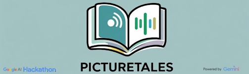

<div align="center">
  
  <h3>PictureTales: Breaking Barriers for Dyslexic Readers</h3>
  <p><em>Transforming photos into accessible, engaging storybooks</em></p>
</div>

> 🏆 **Winner of 2nd Place** at the Google Student AI Hackathon 2025 in Google Dublin, Ireland. This project was created by Team 9: Minh-Khoi Pham, Marco Nocerino, Mohamed Benyounis, Mayank Sehrawat, and Naganirdesh Parisa during the 12-hour hackathon.

## 🌟 The Problem

**1 in 10 people worldwide are dyslexic** — nearly 1 billion people affected by a condition that traditional reading tools simply don't address.

### Total Addressable Market
- **~800M people** in the world have dyslexia
- **$5.2B+** market size (growing at ~6.5% CAGR)

The consequences are profound:
- **Low confidence** in reading abilities
- **Poor engagement** with traditional text
- **Lifelong learning gaps** that compound over time

The current educational system is built for readers — not for the diverse ways people think and process information.

## 🚀 Our Solution

PictureTales is an **AI for Good** platform that transforms photos or general context into fully accessible storybooks using dyslexia-friendly words and design principles. We're making reading effortless, engaging, and confidence-building.

### Key Features

🎯 **Accessibility-First Design**
- Auditory-first experience with customizable high-quality text-to-speech
- Dyslexia-friendly fonts and adjustable layouts to reduce visual stress
- Full control over audio and visual elements for paced, personalized learning

🤖 **Fully Powered by Gemini AI**
- **Text Summarization**: Intelligently condenses complex narratives into digestible, dyslexia-friendly content
- **Advanced Storytelling**: Creates engaging, multi-paragraph narratives tailored to user preferences and themes
- **Smart Content Tailoring**: Adapts vocabulary, sentence structure, and complexity based on accessibility needs
- **AI Image Generation**: Produces consistent, high-quality illustrations that perfectly match story content
- **Visual Consistency**: Maintains character appearance, style, and thematic elements across all generated frames
- **Contextual Understanding**: Ensures seamless narrative flow and visual coherence throughout the entire storybook

📚 **Confidence Building**
- Removes anxiety around reading
- Fosters a genuine love for stories
- Empowers users through personalized experiences

## 🛠️ How It Works

<div align="center">
  
  <p><em>Intuitive, accessibility-first interface design</em></p>
</div>

### 1. 📸 Start with Photos, Not Words
Users upload personal photos, completely avoiding the pressure of writing from scratch. This visual-first approach removes barriers and sparks creativity.

### 2. 🤖 Let AI Create the Story
Our advanced AI crafts unique narratives and generates matching visuals, building a rich, multi-sensory storytelling experience tailored to each user.

### 3. 🎨 Personalize for Accessibility
- **Listen** with adjustable, high-quality narration
- **Customize** text size, spacing, and switch to dyslexia-friendly fonts
- **Control** your pace with voice and speed controls
- **Choose** creative themes like "Fantasy" or "Sci-Fi"

### 4. 💾 Download and Keep
Save your finished storybook as a personalized, accessible PDF ready to enjoy anytime, anywhere, and share with friends and family.

<div align="center">
  
  <p><em>Example of a generated storybook with AI-created illustrations and dyslexia-friendly formatting. The prompt: "a story about the main boy character who has a robot best friend".</em></p>
</div>

## 🎯 User Journey

1. **Login** with your Google account for a seamless experience
2. **Upload** your own pictures to spark the story
3. **Choose** a creative theme that inspires you
4. **Provide** a short description to guide the AI
5. **Watch** as AI weaves a unique, multi-paragraph story
6. **Enjoy** AI-generated illustrations that match your story's style
7. **Listen** to your story read aloud with customizable narration
8. **Customize** fonts, voice, and reading pace to your preferences
9. **Save** your illustrated tale as a high-quality PDF

## 🌍 Impact

We're not just creating storybooks — we're:
- **Building confidence** in reading abilities
- **Fostering creativity** through visual storytelling
- **Removing barriers** that have held back dyslexic learners
- **Empowering** nearly 1 billion people worldwide

## 🚀 Getting Started

### Prerequisites
- Node.js 18.0 or later
- npm or yarn package manager
- Firebase account for authentication and hosting

### Installation

1. Clone the repository:
```bash
git clone https://github.com/kaylode/picture-tales.git
cd picture-tales
```

2. Install dependencies:
```bash
npm install
# or
yarn install
```

3. Set up environment variables:
```bash
cp .env.example .env.local
```
Fill in your Firebase configuration and API keys.

4. Run the development server:
```bash
npm run dev
# or
yarn dev
```

5. Open [http://localhost:3000](http://localhost:3000) in your browser.

## 🛠️ Tech Stack

- **Frontend**: Next.js 14, React, TypeScript
- **Styling**: Tailwind CSS, shadcn/ui components
- **Backend**: Firebase (Authentication, Firestore, Storage)
- **AI**: Google Genkit for story generation and text-to-speech
- **Deployment**: Firebase App Hosting

## 📁 Project Structure

```
├── src/
│   ├── app/                 # Next.js app router
│   ├── components/          # Reusable UI components
│   ├── ai/                  # AI flows and configurations
│   ├── hooks/               # Custom React hooks
│   └── lib/                 # Utility functions and configs
├── resources/               # Static assets and logos
├── docs/                    # Documentation
└── components/              # Additional UI components
```

## 🤝 Contributing

We welcome contributions that help make reading more accessible! Please read our contributing guidelines and feel free to submit issues and pull requests.

## 📄 License

This project is licensed under the MIT License - see the [LICENSE](LICENSE) file for details.

## 🙏 Acknowledgments

- Built with ❤️ for the dyslexic community
- Powered completely by Google Gemini AI and Firebase Studio
- Inspired by the belief that everyone deserves access to the joy of reading


---

<div align="center">
  <p><strong>PictureTales - Where every picture tells an accessible story</strong></p>
</div>
